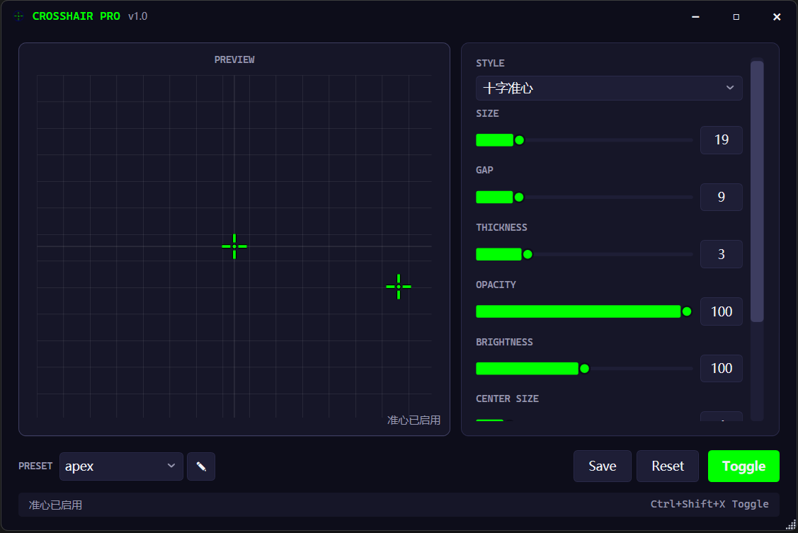

# Crosshair Pro - 外置准心覆盖软件

一款专为FPS游戏玩家设计的准心覆盖软件，提供丰富的自定义选项和低延迟渲染。

## 功能特性

### 核心功能
- ✅ 多种准心样式（十字、点、圆、T形、X形）
- ✅ 完全自定义参数（大小、间隙、厚度、颜色、透明度）
- ✅ 效果增强（描边、阴影、发光）
- ✅ 透明置顶窗口覆盖
- ✅ 全局热键支持
- ✅ 配置保存与加载
- ✅ 预设管理系统

### 准心样式
| 样式 | 描述 | 适用场景 |
|------|------|----------|
| 十字准心 | 四条线从中心向外延伸 | 通用型，最常用 |
| 点状准心 | 单个小点位于中心 | 狙击、精准射击 |
| 圆形准心 | 空心或实心圆环 | 追踪移动目标 |
| T形准心 | 倒T字形 | 头部瞄准 |
| X形准心 | 对角线设计 | 个性化需求 |
| 自定义图片 | 用户上传PNG图片 | 完全个性化 |

## 技术栈

| 组件 | 技术 |
|------|------|
| 框架 | WPF + .NET 8 |
| 架构模式 | MVVM |
| 渲染 | WPF DrawingContext |
| 热键 | Win32 API |
| 配置存储 | JSON文件 |
| MVVM框架 | CommunityToolkit.Mvvm |

## 项目结构

```
CrosshairPro/
├── src/
│   ├── CrosshairPro.Core/              # 核心业务模型
│   │   ├── Models/                     # 数据模型
│   │   ├── Enums/                      # 枚举定义
│   │   └── Interfaces/                 # 接口定义
│   │
│   ├── CrosshairPro.Services/          # 业务服务
│   │   ├── Crosshair/                  # 准心渲染
│   │   └── Configuration/              # 配置管理
│   │
│   ├── CrosshairPro.Infrastructure/    # 基础设施
│   │   ├── Win32/                      # Win32 API封装
│   │   └── Hotkey/                     # 热键管理
│   │
│   └── CrosshairPro.App/               # WPF应用
│       ├── Views/                      # 视图
│       └── ViewModels/                 # 视图模型
│
├── docs/                               # 设计文档
│   ├── PRD.md                          # 产品需求文档
│   ├── technical-design.md             # 技术设计文档
│   ├── prototype-design.md             # 原型设计文档
│   └── ADR.md                          # 架构决策记录
│
└── CrosshairPro.sln                    # 解决方案文件
```

## 快速开始

### 环境要求
- Windows 10/11
- .NET 8 SDK

### 构建项目
```bash
# 还原依赖
dotnet restore

# 构建项目
dotnet build

# 运行项目
dotnet run --project src/CrosshairPro.App
```

### 默认快捷键
| 功能 | 快捷键 |
|------|--------|
| 显示/隐藏准心 | Ctrl+Shift+X |

## 使用截图



## 性能指标

| 指标 | 目标值 |
|------|--------|
| CPU占用 | < 1% |
| 内存占用 | < 50MB |
| 渲染延迟 | < 16ms |
| 启动时间 | < 2秒 |

## 反作弊兼容性

| 反作弊系统 | 兼容性 | 说明 |
|------------|--------|------|
| VAC (Steam) | ✅ 通常安全 | 外部覆盖不读取游戏内存 |
| BattlEye | ⚠️ 需谨慎 | 部分游戏禁止任何覆盖 |
| Easy Anti-Cheat | ⚠️ 需谨慎 | 因游戏而异 |
| Riot Vanguard | ❌ 禁止 | 不允许任何第三方覆盖 |

**注意：** 本软件仅使用外部覆盖层技术，不读取游戏内存、不注入进程。但使用前请确认您游玩的游戏允许此类软件。

## 开发进度

- [x] 项目脚手架搭建
- [x] 核心业务模型
- [x] 准心渲染引擎
- [x] 配置管理服务
- [x] 热键管理服务
- [x] 覆盖窗口实现
- [x] 主界面交互
- [ ] 系统托盘功能
- [ ] 游戏自动检测
- [ ] 多显示器支持
- [ ] 预设导入导出
- [ ] 自定义图片准心

## 许可证

MIT License

## 贡献

欢迎提交 Issue 和 Pull Request！
